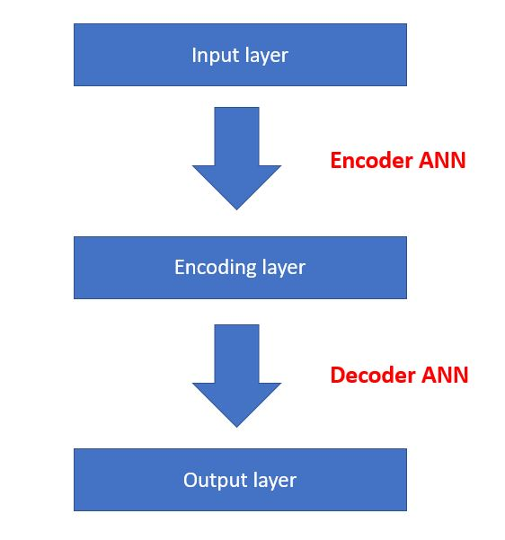
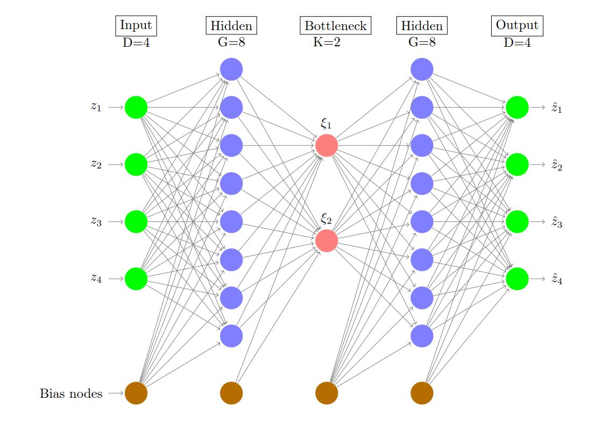
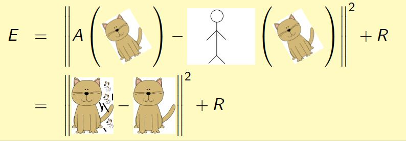
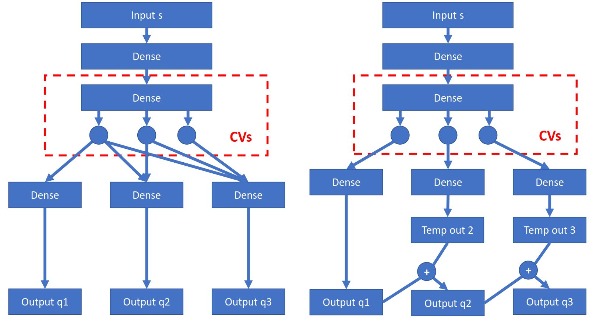

# Accelerated sampling with data-augmented autoencoders

This is the framework for running accelerated sampling with data-augmented autoencoders.

## Dependency

OpenMM simulation pacakge: https://github.com/pandegroup/openmm

ANN_Force biasing force package: https://github.com/weiHelloWorld/ANN_Force

Keras: https://github.com/fchollet/keras

PyBrain (for backward compatibility): https://github.com/weiHelloWorld/pybrain

MDAnalysis: https://github.com/MDAnalysis/mdanalysis

Sklearn: https://github.com/scikit-learn/scikit-learn

Nose testing framework: https://github.com/nose-devs/nose

PLUMED (ANN included): https://github.com/weiHelloWorld/plumed2 

OpenMM-PLUMED force plugin: https://github.com/peastman/openmm-plumed

Some other Python scientific calculation packages (e.g. seaborn, pandas) are also needed, it is recommended to install them with Anaconda: https://www.continuum.io/downloads

For Linux/Ubuntu, you may use following script to install most of these packages:

```bash
echo "installing anaconda2 (please install it manually if you want the latest version)"
ANACONDA_INSTALLATION_FILE=Anaconda2-4.4.0-Linux-x86_64.sh
wget https://repo.continuum.io/archive/${ANACONDA_INSTALLATION_FILE}
bash ${ANACONDA_INSTALLATION_FILE}
export PATH="$HOME/.anaconda2/bin:$PATH"

echo "installing MDAnalysis (including biopython)"
conda install -c mdanalysis mdanalysis

echo "installing OpenMM"
conda install -c omnia openmm

echo "installing theano (may also use pip install theano==0.8.2)"
conda install -c conda-forge theano==0.8.2

echo "installing Keras (may also use pip install keras==1.2.2)"
conda install -c conda-forge keras==1.2.2

echo "installing coverage (for nosetests)"
conda install -c conda-forge coverage

echo "installing PyBrain"
pip install git+https://github.com/weiHelloWorld/pybrain.git

echo "you may need to install following packages manually: PLUMED, OpenMM-plumed, ANN_Force"
```

## Installation and preparation

No installation is required.  You may simply have all dependent packages installed and checkout this repository (or download the package with dependency files here: https://drive.google.com/a/illinois.edu/file/d/0B6OOQc-KDdimbklIbkd1cjhnSWs/view?usp=sharing).  Reference pdb files for simulation are needed.

It is **highly recommended** to run tests before running code to make sure packages are correctly installed.

## Testing

This package uses `nosetest` framework.  To run testing, run

```bash
root_dir=accelerated_sampling_with_autoencoder/MD_simulation_on_alanine_dipeptide/current_work
cd ${root_dir}/tests
make test
```

Tests include numerical unit tests (for tests with clear expected results) and figure plots (for others, such as training).

## 1-minute quick start

Go ahead to modify configuration file `${root_dir}/src/config.py`, and run 

```bash
python main_work.py
```

For more options, type

```bash
python main_work.py --help
```

## Quick introduction to autoencoders

A typical autoencoder consists of encoder ANN and decoder ANN, where encoder ANN maps inputs to a small number of collective variables (CVs) in encoding layer and decoder ANN tries to reconstruct inputs (or some variants of inputs) from CVs:



A typical 5-layer structure is given below:



For traditional autoencoders, we minimize

$$E=|A(x)-x|^2 + R$$

where $A$ is autoencoder mapping function, $R$ is regularization term.

To remove external degrees of freedom, we use data-augmented autoencoders, which minimizes

$$E=|A(x)-L(x)|^2 + R$$

where $L$ is the alignment function responsible for data augmentation.  It can be written in "cat form" as (cat = molecule configuration, little human = alignment function L):



To possibly remove dependency on specific reference, we apply multiple references to data-augmented autoencoders, corresponding error function is 

$$E=\sum_j |A_j(x)-L_j(x)|^2 + R$$

where $A_j$ are autoencoders that share all but the last layer, and $L_j$ is alignment functions with respect to reference $j$.

If we want to see relative importance among these CVs, we construct multiple outputs with each output taking contribution from some of CVs in encoding layer.  Two possible types of network topology are given below:



Corresponding error function is then

$$E=E_{1}+E_{1,2}+E_{1,2,3}+...$$

where $E_{1}$ is reconstruction error when only 1st CV is used to compute output, $E_{1,2}$ is reconstruction error when only first two CVs are used to compute output, ...

See slides for more information: (TODO)


## Directory structure

Directories are arranged as follows:

```
${root_dir}/src: source code
${root_dir}/target: output of simulation data (pdb files and coordinate files)
${root_dir}/resources: training results (autoencoders), and reference configurations files (pdb files)
${root_dir}/tests: test source code
```


## TODO

## Best practices

TODO

## Extensions

- How to apply this framework to new molecules?

1. Create a subclass of `Sutils` for the molecule and implement corresponding methods in `${root_dir}/src/molecule_spec_sutils.py`.

2. Include molecule-specific information in the configuration file `${root_dir}/src/config.py`, and modify corresponding configuration settings.

3. Modify biased simulation file (`${root_dir}/src/biased_simulation_general.py`) for the new molecule.

4. Add molecule-related statements to `${root_dir}/src/ANN_simulation.py` and `${root_dir}/src/autoencoders.py` whenever `Trp_cage` appears.

- How to apply a new network structure or switch to a new training backend?

1. Create a subclass of `autoencoder` for the new structure/backend and do implementation.  Note that all abstract methods (`@abc.abstractmethod`) must be implemented.

2. Include new network information in the configuration file `${root_dir}/src/config.py`.

## Contact

For any questions, feel free to contact weichen9@illinois.edu or open a github issue.
